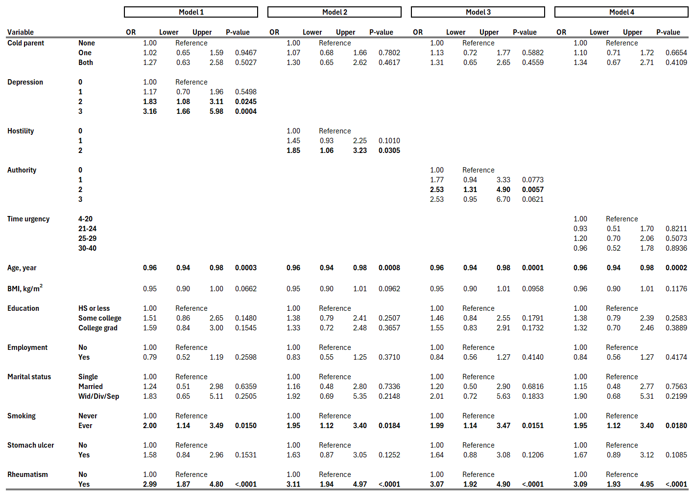
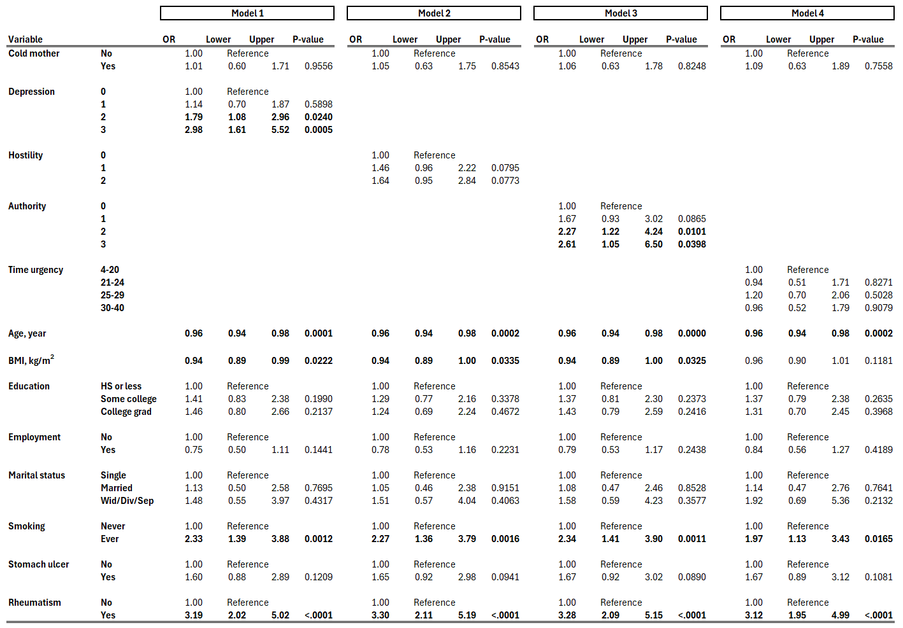
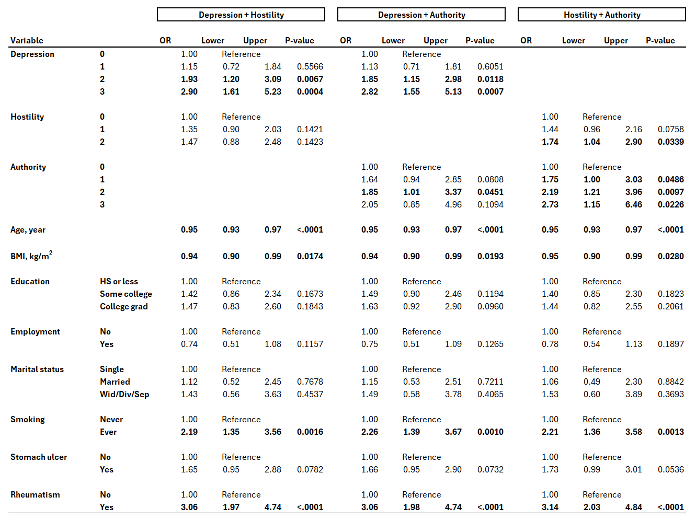

```{r setup, include=FALSE}
knitr::opts_chunk$set(echo = TRUE)

# Required packages
pacs <- c("tidyverse", "readxl", "janitor", "broom", "mice", "tableone", "gtsummary")
sapply(pacs, require, character.only = TRUE)

# Read SAS data
# n.obs = 5067
overlap0 <- read_excel("./data/choi_principle.xls", na = ".Z") %>% 
  clean_names() %>% 
  rename(analysisid = ahs1_qid_to_analysis_id)

# Overlap population, female only -----------------------------------------

# n = 3136 women
overlap_f <- overlap0 %>% 
  filter(sex == 0) %>% 
  
  # Define incident cases of fibromyalgia
  mutate(
    fibro_inc = case_when(
      (fibroy >= 1 & fibroy <= 4) | fibro == 2 ~ 1,
      TRUE ~ 0
      ),
    fm_stat = factor(fibro_inc, labels = c("Non-case", "Case"))
  ) %>%

  # Demographics and lifestyles
  mutate(
    agecat = cut(agein, breaks = c(20, 30, 40, 50, 60, Inf), right = FALSE),
    agecat = factor(agecat, labels = c("20-29", "30-39", "40-49", "50-59", "60+")),
    
    bmicat = cut(ahs1_bmi, breaks = c(0, 25, 30, Inf), right = FALSE),
    bmicat = factor(bmicat, labels = c("<25", "25-<30", "30+")),
      
    educat3 = recode(educcq, 1, 1, 1, 2, 3, 3),
    educat3 = factor(educat3, labels = c("Less than HS", "Some college", "College grad+")),
    
    marital3 = recode(maritlcq, 1, 2, 3, 3),
    marital3 = factor(marital3, labels = c("Not married", "Married", "Wid/Div/Sep")),
    
    smoke2 = recode(smoke, 1, 1, 0),
    smoke2 = factor(smoke2, labels = c("Never", "Ever")),
    
    employ2 = factor(workpay, labels = c("No", "Yes"))
  ) %>% 
  
  # Parenting
  mutate(
    parent_cold = case_when(
      (mcold == 1 & fcold == 0) | (mcold == 0 & fcold == 1) ~ 1,
      mcold == 1 & fcold == 1 ~ 2,
      mcold == 2 & fcold == 2 ~ NA_integer_,
      TRUE ~ 0
    ),
    parent_cold = factor(parent_cold, labels = c("None", "One", "Both")),
    
    cold_mother = case_when(
      mcold == 0 ~ 0,
      mcold == 1 ~ 1,
      mcold == 2 ~ NA_integer_
    ),
    cold_mother = factor(cold_mother, labels = c("No", "Yes")),
    
    cold_father = case_when(
      fcold == 0 ~ 0,
      fcold == 1 ~ 1,
      fcold == 2 ~ NA_integer_
    ),
    cold_father = factor(cold_father, labels = c("No", "Yes")),
    
    parent_warm = case_when(
      (mwarm == 1 & fwarm == 0) | (mwarm == 0 & fwarm == 1) ~ 1,
      mwarm == 1 & fwarm == 1 ~ 2,
      mwarm == 2 & fwarm == 2 ~ NA_integer_,
      TRUE ~ 0
    ),
    parent_warm = factor(parent_warm, labels = c("None", "One", "Both")),
    
    # Family structure: Based on AHS-2 variable "RAISED"
    # Replace "Raised by" variable that appears in the manuscript
    fam_struct = case_when(
      raised == 1 ~ 0,
      raised == 2 ~ 1,
      raised %in% 3:4 ~ 2,
      raised == 5     ~ 3,
      is.na(raised)   ~ 4
    ),
    fam_struct = factor(fam_struct, labels = c("Two birthparents", "Two parents*", "Single-birthparent", "Other", "Unknown")),
    
    # Personality traits
    # Note reversed signs
    urgency     = (11 - rushed) + competv + tasks + (11 - fasteat),
    urgency4    = cut(urgency, breaks = c(4, 21, 25, 30, Inf), right = FALSE),
    urgency4    = factor(urgency4, labels = c("4-20", "21-24", "25-29", '30-40')),
    
    depression  = (2 - overcome) + (2 - happy) + (family - 1),
    depression4 = factor(depression),
    
    authority   = (2 - respect) + (2 - counton) + (2 - showfel),
    authority4  = factor(authority),
    
    hostility   = case_when(
      geteven == 2 & dislike == 1 ~ 0,
      (geteven == 1 & dislike == 1) | (geteven == 2 & dislike == 2) ~ 1, 
      geteven == 1 & dislike == 2 ~ 2,
    ),
    hostility3  = factor(hostility),
    
    jobstress = case_when(
      jobsat %in% 1:2 | jobfrus %in% 3:4 ~ 0,
      jobsat %in% 3:4 & jobfrus %in% 1:2 ~ 1
    ),
    jobstress = factor(jobstress, labels = c("Low frus or hi satis", "Hi frus & low satis")),
    
    ulcer_dx = factor(ulcerc - 1, labels = c("No", "Yes")),
    
    rheumtsm_dx = factor(rheumtsm - 1, labels = c("No", "Yes"))
  )

```

## Datasets 

* The overlap population between AHS-1 and AHS-2
  * See the manuscript how record linkage was done

* Contains 5067 subjects. Among them, there were n = 3136 women.

## Exclusion criteria

* The dataset appears to have already excluded those who were diagnosed for fibromyalgia 20 or more years ago
  * (See the Outcome section below as well)
  * (The manuscript reports the original sample size of n = 3156, and then 20 subjects were excluded for prevalent cases)
  
## Outcome

* Self-reported diagnosis of fibromyalgia from **AHS-2 baseline** questionnaire ([Page A4, under the section of musculoskeletal system](https://wiki.ahs2.org/_media/baseline:ahs_baseline_v3_-_page_a4.jpg))
  * Years since first diagnosis: Less than 5 years ago, 5-9 yrs ago, 10-14 yrs ago, 20+ yrs ago
  * Have you been treated for this in the last 12 months?: No or Yes
  * See the crosstab below
    * 127 females reported their FM diagnosis. ~~None of these were diagnosed 20+ years ago~~
      * The dataset appears to have excluded those who were diagnosed for FM 20 or more years ago (See the manuscript)
    * 64 females were treated in the last 12 month. Among them, 9 females did not indicate their diagnosis year
  * If diagnosed < 20 years ago or treated within the last 12 months, they were considered as incident cases
    * According to this classification rule, there are 136 incident cases (4.3%) out of 3136 women

```{r fibro_crosstab, echo = FALSE}

# Crosstab between fibroy and fibro
overlap_f %>%
  mutate(
    fibroy = factor(fibroy, labels = c("<5 yrs", "5-9 yrs", "10-14 yrs", "15-19 yrs", "20+ yrs"), levels = 1:5),
    fibro  = factor(fibro,  labels = c("No", "Yes"))
    ) %>% 
  tabyl(fibroy, fibro) %>% 
  adorn_totals(where = c("row", "col")) %>% 
  knitr::kable()

```

## Exposure of interest

* All of the followings were derived from **AHS-1 questionnaire**, except for family structure in early life. Variable names in the data were indicated below
  * See also: Table 1 of the manuscript

* Early life experiences (See [the questions in AHS-1](./images/AHS1_Q37.png))
  * Warm parenting: `mwarm` and `fwarm` combined
  * Cold parenting: `mcold` and `fcold` combined
  * ~~Parent situation~~: Removed or replaced with "family structure" 
  * Family structure
    * Replace "Raised by" variable
    * Based on AHS-2 BQ, Page E2, Q8, asking "Up through age 16 years, were you mostly raised with" (See [the questions in AHS-2](./images/AHS2_BQ_E2Q8.png))
    * If answered "Your two birth parents", then categorized into "Two birthparents"
    * If answered "Two parents, but one or both...", then categorized into "Two parents*" (one or both were not birth parent)
    * If answered "A female birthparent only" or "A male birthparent only", then categorized into "Single-birthparent"
    * If answered "Other" then categorized into "Other"
    * If not answered (missing) then categorized into "Unknown" (missing values were not imputed)

* Psychologic characteristics (See [the questions in AHS-1](./images/AHS1_Q52.png))
  * Depression index score:
    * `family`, `happy`, `overcome`
    * yes/no
    * A negative response gets 1, otherwise 0
    * Points were summed up, ranging from 0 to 3
    
  * Hostility index score:
    * `dislike`, `geteven`
    * yes/no or agree/disagree
    * A negative response gets 1, otherwise 0
    * Points were summed up, ranging from 0 to 2
    
  * Authoritarian index score:
    * `counton`, `showfel`, `respect`
    * agree/disagree
    * A negative response gets 1, otherwise 0
    * Points were summed up, ranging from 0 to 3
    
  * Time urgency index score:  (See [the questions in AHS-1](./images/AHS1_Q61.png))
    * `rushed`, `competv`, `tasks`, `fasteat`
    * 10-point likert scale
    * Scales were reversed for `rushed` and `fasteat` (see AHS-1 questionnaire) before summing up
    * Possible range: from 4 to 40
      * ~~The distribution of this score does **NOT** match with those shown in Table 3 of the manuscript~~
    * Cut-off values were changed as follows: 4-20, 21-24, 25-29, 30-40
      * With these groupings, the numbers match up with those in Table 3 of the manuscript
      * Apparently, the labels were incorrect in the manuscript

* Job stress
  * Based on AHS-1 Q21 and Q22 (See [the questions in AHS-1](./images/AHS1_Q21.png))
    * `jobsat`: How well satisfied are you with job
    * `jobfrus`: How often are you irritated or frustrated by your job
    * If answered ("Not too satisfied" OR "Not at all satisfied") AND ("Always" OR "Often"), then categorized to "High frustration and low satisfaction"
      * Otherwise categorized to "Low frustration or high satisfaction"

## Multiple imputation

* Data have some missing values. For example: 
  * BMI is missing in about 9% of n = 3,136
  * ~~Family structure during early years of life has missing values for about 9.5% of the subjects~~ (decided not to impute)

* Multiple imputation was performed using chained equations ([van Buuren & Groothuis-Oudshoorn, 2011](https://cran.r-project.org/web/packages/mice/citation.html)) in the `mice` package, assuming that data are missing at random.
  * Ten imputed datasets were produced from an imputation model containing the outcome, exposure variables, and covariates (demographics, BMI, comorbidity) that were used in logistic models (described later)

## Descriptive table

* All of the followings were derived from **AHS-1 questionnaire**, except for family structure (see the section above)

* See below for some of demographic/lifestyle variables:
  * Education: Based on the AHS-1 variable `EducCQ`, categorized into 3 levels as shown in the table
  * Employment: Based on AHS-1 Q20, categorized into 2 levels: Employed or Unemployed
    * Employed: Self-employed, full time or part time employed
    * Unemployed: Out of work, student, homemaker, volunteer worker, retired
  * Marital status: Based on the AHS-1 variable `MaritalCQ`, categorized into 3 levels as shown in the table
  * Smoking status: Based on AHS-1 Q27, categorized into 2 levels: Never or Ever
  * Prevalent stomach ulcer: Based on AHS-1 Q5: No or Yes 
  * Prevalent rheumatism: Based on AHS-1 Q5: No or Yes 

* (The descriptive table below was produced using the first imputed dataset)

* ~~Note the number of missing values as well. How should we handle the missing values?~~
  * ~~**[TO DO]** We will perform multiple imputation assuming missing at random (MAR)~~
  * ~~**[TO DO]** Descriptive table below will be replaced with one created from the imputed dataset~~ 


```{r descriptive_table, echo = FALSE, out.width = "50%"}

# Load imputed data -------------------------------------------------------

# Load imputed data (post-processed) from RDS file
imputed_processed <- readRDS("imputed_processed2.rds")


 # Table 1 -----------------------------------------------------------------

# Variables to be included 
# all vars come from AHS-1, except for family structure
table_vars <- c(
  "agecat",
  "agein",
  "bmicat",
  "ahs1_bmi",
  "educat3",
  "employ2",
  "marital3",
  "smoke2",
  "ulcer_dx",
  "rheumtsm_dx",
  "parent_warm",
  "parent_cold",
  "cold_mother",
  "cold_father",
  "fam_struct",
  "depression4",
  "hostility3",
  "authority4",
  "urgency4",
  "jobstress"
)

# Use the first imputation
imp1 <- complete(imputed_processed, action = 1)

imp1 %>%
  select(all_of(table_vars), fm_stat) %>% 
  tbl_summary(
    by = "fm_stat",
    statistic = list(all_continuous() ~ "{mean} ({sd})"),
    digits = all_continuous() ~ 1,
    type = list(
      employ2 ~ "categorical", 
      cold_mother ~ "categorical", 
      cold_father ~ "categorical",
      ulcer_dx ~ "categorical",
      rheumtsm_dx ~ "categorical"
      ),
    # missing = "always",
    # missing_text = "(Missing)"
  ) %>%
  add_overall() %>% 
  add_p(
    test = list(all_continuous() ~ "t.test"),
    pvalue_fun = label_style_pvalue(digits = 3),
  ) %>% 
  as_flex_table()

```

## Distribution for age and BMI

* See below for distributions of age and BMI:
  * The distribution of BMI (`ahs1_bmi`) is right-skewed as expected, but there are no extreme/unusual outliers.


```{r check_distribution, echo = FALSE, warning = FALSE, message = FALSE, fig.height = 3}

imp1 %>% 
  select(agein, ahs1_bmi) %>% 
  pivot_longer(1:2, names_to = "Variable", values_to = "Value") %>% 
  ggplot(aes(x = Value)) +
  geom_histogram(aes(y = after_stat(density)), fill = "gray") +
  geom_density(color = "cornflowerblue", linewidth = 1) +
  facet_wrap(~ Variable, scales = "free")

```

### Correlations among exposure variables

* A Spearman correlation matrix among exposure variables is shown below:
  * A high correlation was observed between `parent_warm` and `parent_cold` (cor = -0.79), which is expected
  * `cold_mother` and `cold_father` was only weakly correlated with each other (corr = 0.20)

* Except for warm and cold parents, the correlations were not very strong. Multicollinearity should not pose a concern unless warm-parents and cold-parents are entered into the model simultaneously


```{r correlation_matrix, echo = FALSE, warning = FALSE, message = FALSE}

# Exposure of interest ----------------------------------------------------

# Exposure variables of interest
ind_vars <- c(
  "parent_warm",
  "parent_cold",
  "cold_mother",
  "cold_father",
  "fam_struct",
  "depression4",
  "hostility3",
  "authority4",
  "urgency4",
  "jobstress"
)

# Spearman correlation matrix
cm <- imp1 %>%
  select(all_of(ind_vars)) %>%
  mutate_all(as.numeric) %>%
  cor(method = "spearman", use = "pairwise")

ggcorrplot::ggcorrplot(
  cm, 
  lab = TRUE, 
  type = "lower",
  title = "Spearman cor matrix among exposures")

```

## Logistic models

* For each exposure variable of interest, first we fit logistic models using incident fibromyalgia as the outcome to obtain unadjusted odds ratios associated with the exposure variable

* Logistic models were fitted for each of 10 imputed datasets, and the results were pooled using Rubin's rules

* ([See the table of unadjusted and adjusted odds ratio here in Excel format](./results/pooled_results_OR_unadj_and_adj_for_demog.xlsx))

### Unadjusted odds ratios

* Unadjusted odds ratios for each exposure variable are shown below
  * Note that reference groups are not shown in the table
    * For warm parenting, the reference is "Both"
    * For other exposure variables, the reference is the first level shown in the descriptive table 
    
* There was a significant trend for warm/cold parenting, depression, hostility, authority

```{r unadjusted_odds_ratios, echo = FALSE, warning = FALSE, message = FALSE}

# Logistic regression: Unadjusted ORs -------------------------------------

# Exposure variables of interest
ind_vars <- c(
  "parent_warm_rev",
  "parent_cold",
  "cold_mother",
  "cold_father",
  "fam_struct",
  "depression4",
  "hostility3",
  "authority4",
  "urgency4",
  "jobstress"
)

# Covariates
covars <- c(
  "agein",
  "ahs1_bmi",
  "educat3",
  "employ2",
  "marital3",
  "smoke2",
  "ulcer_dx",
  "rheumtsm_dx"
)

# Function to run logistic reg on mids object
mice_logistic <- function(formula){
  model_fits <- with(imputed_processed, glm(as.formula(formula), family = "binomial"))
  pooled_results <- pool(model_fits)
  out <- summary(pooled_results, conf.int = TRUE, exponentiate = TRUE) %>% 
    slice(-1) %>% 
    select(term, estimate, conf.low, conf.high, p.value)
}

# Create models
model_formulas <- paste0("fibro_inc ~ ", ind_vars)

# Run models
unadjusted_results <- map(model_formulas, ~ mice_logistic(.x)) %>% 
  bind_rows() %>%
  remove_rownames() %>% 
  mutate(
    predictor = str_extract(as.character(term), paste0(ind_vars, collapse = "|")),
    term = gsub(paste0(ind_vars, collapse = "|"), "", term)
    ) %>% 
  select(predictor, everything())

# Trend p-values
model_formulas <- paste0("fibro_inc ~ as.numeric(", ind_vars, ")")
unadjusted_trendp <- map(model_formulas, ~ mice_logistic(.x)) %>% 
  bind_rows() %>%
  remove_rownames() %>% 
  mutate(term = gsub("as.numeric\\(|\\)", "", term)) %>% 
  rename(trend.p = p.value) %>% 
  filter(!(term %in% c("jobstress", "cold_mother", "cold_father", "fam_struct"))) %>% 
  mutate(trend.p = format.pval(trend.p, digits = 2)) %>% 
  select(term, trend.p) 

options(knitr.kable.NA = "")
unadjusted_results %>% 
  left_join(unadjusted_trendp, by = c("predictor" = "term")) %>% 
  rename(odds.ratio = estimate) %>% 
  mutate(across(odds.ratio:conf.high, round, 2)) %>%
  group_by(predictor) %>%
  mutate(
    p.value = round(p.value, 4),
    trend.p = if_else(row_number() == 1, trend.p, NA_character_)
    ) %>%
  ungroup() %>% 
  knitr::kable()

```

### Odds ratios, adjusted for demographics, lifestyles and comorbidity 

* This time, we fit multivariable logistic models adjusting for:
  * Age as continuous
  * BMI as continuous
    * ~~**[TO DO]** Check for non-linearity, possibly using a GAM model~~
    * Linearity assumption was checked for BMI using a generalized additive model that includes a non-linear term for BMI, adjusting for demographic variables and comorbidity
    * The non-linear term of BMI was not significant (p = 0.13) and its effective df was close to 1 (EDF = 1.435), suggesting that the association between incident fibromyalgia and BMI is (if any) linear on logit scale when adjusting for other variables
  * Education as categorical
  * Employment as binary (employed/unemployed)
  * Marital status as categorical
  * Smoking as binary (Never/ever)
  * Comorbidity: Stomach ulcer and rheumatism (No/Yes)
    * From [AHS-1 questionnaire Q5](./images/AHS1_Q5.png): "Has a doctor EVER told you that you had..."

* Again, the logistic models were fitted for each of 10 imputed datasets, and the results were pooled using Rubin's rules

* Adjusted odds ratios for each exposure variable are shown below
  * Note that reference groups are not shown in the table
    * For warm parenting, the reference is "Both"
    * For other exposure variables, the reference is the first level shown in the descriptive table 
    
* There was a significant trend for warm/cold parenting, depression, hostility, authority

```{r adjusted_odds_ratios, echo = FALSE, warning = FALSE, message = FALSE}

# Logistic regression: Adjusted ORs ---------------------------------------

# Create models
# Covariates
add_covars <- paste0(covars, collapse = " + ")
model_formulas <- paste0("fibro_inc ~ ", ind_vars, " + " , add_covars)

# Run models
adjusted_results <- map(model_formulas, ~ mice_logistic(.x)) %>% 
  bind_rows() %>%
  remove_rownames() %>% 
  mutate(
    predictor = str_extract(as.character(term), paste0(ind_vars, collapse = "|")),
    term = gsub(paste0(ind_vars, collapse = "|"), "", term)
    ) %>% 
  filter(!is.na(predictor)) %>% 
  select(predictor, everything())

# Trend p-values
model_formulas <- paste0("fibro_inc ~ as.numeric(", ind_vars, ")" ,  " + ", add_covars)
adjusted_trendp <- map(model_formulas, ~ mice_logistic(.x)) %>% 
  bind_rows() %>%
  remove_rownames() %>% 
  mutate(
    predictor = str_extract(as.character(term), paste0(ind_vars, collapse = "|")),
    term = gsub("as.numeric\\(|\\)", "", term)
    ) %>% 
  rename(trend.p = p.value) %>% 
  filter(predictor %in% ind_vars) %>% 
  filter(!(term %in% c("jobstress", "cold_mother", "cold_father", "fam_struct"))) %>% 
  mutate(trend.p = format.pval(trend.p, digits = 2)) %>% 
  select(predictor, trend.p) 

adjusted_results %>% 
  left_join(adjusted_trendp, by = "predictor") %>% 
  rename(odds.ratio = estimate) %>% 
  mutate(across(odds.ratio:conf.high, round, 2)) %>%
  group_by(predictor) %>%
  mutate(
    p.value = round(p.value, 4),
    trend.p = if_else(row_number() == 1, trend.p, NA_character_)
    ) %>%
  ungroup() %>% 
  knitr::kable()

```

## Multiple exposure models

### Cold parent + psychological variables

* Following four logistic models were fitted:
  * Includes either one of psychological variables, depression, hostility, authority, or time urgency
  * Always includes cold parent (none/one/both, none as the reference)
  * Also adjusting for age, BMI, education, employment, marital status, smoking, and comorbidity variables
  * using data that include only those subjects who were raised by either "two birthparents" or "two parents (one or both were not birth parent)

* [See the Excel table for odds ratios in the four models](./results/pooled_results_OR_multi_exposure_models_cold_parent.xlsx)



* In all the four models, higher odds of developing FM were observed when one or both parents were perceived cold, but ORs were not statistically significant (OR = 1.02 to 1.13 for one cold parent; 1.27 to 1.34 for both cold)

* Among psychological characteristics:
  * Depression was associated with significantly higher odds of FM in a "dose-response" manner, adjusting for cold parenting, demographics/lifestyle and stomach ulcer
  * Hostility and authority scales showed elevated ORs, but some of them were not statistically significant
  * However, there were no statistically significant ORs for time urgency scale

* Sensitivity analysis was conducted, excluding those with rheumatism. 
  * [See the result here](./images/pooled_results_OR_multi_exposure_models_cold_parent_excludes_rheumatism.png) 
  * [See the result in Excel format](./results/pooled_results_OR_multi_exposure_models_cold_parent_excludes_rheumatism.xlsx)

### Warm parent + psychological variables

* Similarly, four logistic models were fitted, this time replacing cold parent with warm parent
  * Includes either one of psychological variables, depression, hostility, authority, or time urgency
  * Always includes warm parent (none/one/both, both as the reference)
  * Also adjusting for age, BMI, education, employment, marital status, smoking, and stomach ulcer
  * using data that include only those subjects who were raised by either "two birthparents" or "two parents (one or both were not birth parent)

* [See the Excel table for odds ratios in the four models](./results/pooled_results_OR_multi_exposure_models_warm_parent.xlsx)


* Except for Model 1, significantly higher odds of developing FM were observed when only one of parents were perceived warm (OR = 1.47 to 1.63). The ORs associated with no warm parents were slightly lower and not statistically significant (OR = 1.40 to 1.52)

* Depression was associated with significantly higher odds of FM in a "dose-response" manner, adjusting for warm parenting, demographics/lifestyle and comorbidity
  * Hostility and authority scales showed elevated ORs, but some of them were not statistically significant
  * However, there were no statistically significant ORs for time urgency scale

* Sensitivity analysis was conducted, excluding those with rheumatism. 
  * [See the result here](./images/pooled_results_OR_multi_exposure_models_warm_parent_excludes_rheumatism.png)
  * [See the result in Excel format](./results/pooled_results_OR_multi_exposure_models_warm_parent_excludes_rheumatism.xlsx)

### Cold mother + psychological variables

* Similarly, four logistic models were fitted, this time replacing cold/warm parent with **cold mother**
  * Includes either one of psychological variables, depression, hostility, authority, or time urgency
  * Always includes cold mother (no/yes; no as the reference)
  * Also adjusting for age, BMI, education, employment, marital status, smoking, and stomach ulcer
  * using data that include only those subjects who were raised by either "two birthparents", "two parents (one or both were not birth parent), or single female birthparent

* [See the Excel table for odds ratios in the four models](./results/pooled_results_OR_multi_exposure_models_cold_mother.xlsx)



* In all the four models, cold mother was not associated with FM after adjusting for other variables.

* Depression and authority scales were associated with significantly higher odds of FM in a "dose-response" manner, adjusting for cold mother, demographics/lifestyle and comorbidity
  * However, there were no statistically significant ORs for hostility and time urgency scales

* Sensitivity analysis was conducted, excluding those with rheumatism. 
  * [See the result here](./images/pooled_results_OR_multi_exposure_models_cold_mother_excludes_rheumatism.png)
  * [See the result in Excel format](./results/pooled_results_OR_multi_exposure_models_cold_mother_excludes_rheumatism.xlsx)

### Personality models

* Following three logistic models were fitted, without any parenting style variables:
  * Depression + hostility 
  * Depression + authority 
  * Hostility + authority
  * Depression + Hostility + authority
  * All models adjusting for age, BMI, education, employment, marital status, smoking, and comorbidity variables

* [See the Excel table for odds ratios in the four models](./results/pooled_results_OR_multi_exposure_models_personality.xlsx)



* When a model includes depression, the variable always shows a "dose-response" relationship, with the two severely-depressed groups being highly significant

* Similarly, authority is positively associated with FM in a "dose-response" matter when adjusting for hostility

* Sensitivity analysis was conducted, excluding those with rheumatism. 
  * [See the result here](./images/pooled_results_OR_multi_exposure_models_personality_excludes_rheumatism.png)
  * [See the result in Excel format](./results/pooled_results_OR_multi_exposure_models_personality_excludes_rheumatism.xlsx)

## Change/Meeting log

* **04/13/2026**:
  * Ran a model with depression, hostility, and authority during the meeting
  * The manuscript needs to be revised
  * Next meeting: Monday, May 4
  * Next paper: Telomere length as continuous & Authority
    * Check to see if we have n ~ 300 with personality variables

* **03/23/2026**:
  * Two-personality models: After removing parenting,
    * **[Done]** Depression + (hostility or authority)
    * **[Done]** Hostility + Authority 
  
* **03/16/2026**:
  * Exclude or adjust for prevalent cases of rheumatism?
    * For sensitivity analysis
      * **[Done]** Adjust for it if kept in the data
      * **[Done]** Then exclude them for model comparison
      
  * Family structure: 
    * **[Done]** Missing ("Unknown") as another level of family structure (Do not impute)
    * **[Done]** Sensitivity analysis excluding unknown
  
  * Logistic models: Remove the parenting variable and include two or more of the personality types?
  
* **03/14/2026**:
  * For logistic models:
    * Added two more covariates: Smoking status (Never/Ever) and stomach ulcer (No/Yes). See the section of "Descriptive table"
      * Somehow, even though smoking was associated with the outcome in the descriptive table, this variable was never adjusted in logistic models in the manuscript
      * Stomach ulcer was associated with the outcome and thus added into the models as a covariate
  * Added more multiple exposure models
    * Warm parent + psychological variables
    * Cold mother + psychological variables

* **03/07/2026**:
  * Added the following sections:
    * Exclusion criteria
    * Multiple imputation
    * Correlation among exposure variables
    * Multiple exposure models
  * Due to missing values, multiple imputation by chain equations was implemented. See the section of "Multiple imputation"
  * For preliminary analyses, Spearman correlations among exposure variables were examined
  * Some multiple exposure models were added: Cold parent + one of psychological variables
    * The excel file containing the model summary was added into the repository
