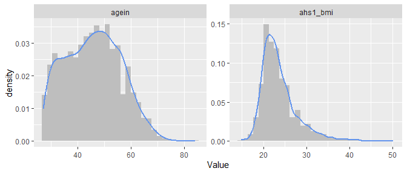

AHS Overlap Population Fibromyalgia Study
================

## Datasets

- The overlap population between AHS-1 and AHS-2
  - See the manuscript how record linkage was done
- Contains 5067 subjects. Among them, there were n = 3136 women.

## Exclusion criteria

- The dataset appears to have already excluded those who were diagnosed
  for fibromyalgia 20 or more years ago
  - (See the Outcome section below as well)
  - (The manuscript reports the original sample size of n = 3156, and
    then 20 subjects were excluded for prevalent cases)

## Outcome

- Self-reported diagnosis of fibromyalgia from **AHS-2 baseline**
  questionnaire ([Page A4, under the section of musculoskeletal
  system](https://wiki.ahs2.org/_media/baseline:ahs_baseline_v3_-_page_a4.jpg))
  - Years since first diagnosis: Less than 5 years ago, 5-9 yrs ago,
    10-14 yrs ago, 20+ yrs ago
  - Have you been treated for this in the last 12 months?: No or Yes
  - See the crosstab below
    - 127 females reported their FM diagnosis. ~~None of these were
      diagnosed 20+ years ago~~
      - The dataset appears to have excluded those who were diagnosed
        for FM 20 or more years ago (See the manuscript)
    - 64 females were treated in the last 12 month. Among them, 9
      females did not indicate their diagnosis year
  - If diagnosed \< 20 years ago or treated within the last 12 months,
    they were considered as incident cases
    - According to this classification rule, there are 136 incident
      cases (4.3%) out of 3136 women

| fibroy    |  No | Yes | NA\_ | Total |
|:----------|----:|----:|-----:|------:|
| \<5 yrs   |  15 |  25 |   13 |    53 |
| 5-9 yrs   |  13 |  15 |   10 |    38 |
| 10-14 yrs |   9 |  11 |    3 |    23 |
| 15-19 yrs |   3 |   4 |    6 |    13 |
| 20+ yrs   |   0 |   0 |    0 |     0 |
| NA        | 236 |   9 | 2764 |  3009 |
| Total     | 276 |  64 | 2796 |  3136 |

## Exposure of interest

- All of the followings were derived from **AHS-1 questionnaire**,
  except for family structure in early life. Variable names in the data
  were indicated below
  - See also: Table 1 of the manuscript
- Early life experiences (See [the questions in
  AHS-1](./images/AHS1_Q37.png))
  - Warm parenting: `mwarm` and `fwarm` combined
  - Cold parenting: `mcold` and `fcold` combined
  - ~~Parent situation~~: Removed or replaced with “family structure”
  - Family structure
    - Replace “Raised by” variable
    - Based on AHS-2 BQ, Page E2, Q8, asking “Up through age 16 years,
      were you mostly raised with” (See [the questions in
      AHS-2](./images/AHS2_BQ_E2Q8.png))
    - If answered “Your two birth parents”, then categorized into “Two
      birthparents”
    - If answered “Two parents, but one or both…”, then categorized into
      “Two parents\*” (one or both were not birth parent)
    - If answered “A female birthparent only” or “A male birthparent
      only”, then categorized into “Single-birthparent”
    - If answered “Other” then categorized into “Other”
- Psychologic characteristics (See [the questions in
  AHS-1](./images/AHS1_Q52.png))
  - Depression index score:
    - `family`, `happy`, `overcome`
    - yes/no
    - A negative response gets 1, otherwise 0
    - Points were summed up, ranging from 0 to 3
  - Hostility index score:
    - `dislike`, `geteven`
    - yes/no or agree/disagree
    - A negative response gets 1, otherwise 0
    - Points were summed up, ranging from 0 to 2
  - Authoritarian index score:
    - `counton`, `showfel`, `respect`
    - agree/disagree
    - A negative response gets 1, otherwise 0
    - Points were summed up, ranging from 0 to 3
  - Time urgency index score: (See [the questions in
    AHS-1](./images/AHS1_Q61.png))
    - `rushed`, `competv`, `tasks`, `fasteat`
    - 10-point likert scale
    - Scales were reversed for `rushed` and `fasteat` (see AHS-1
      questionnaire) before summing up
    - Possible range: from 4 to 40
      - ~~The distribution of this score does **NOT** match with those
        shown in Table 3 of the manuscript~~
    - Cut-off values were changed as follows: 4-20, 21-24, 25-29, 30-40
      - With these groupings, the numbers match up with those in Table 3
        of the manuscript
      - Apparently, the labels were incorrect in the manuscript
- Job stress
  - Based on AHS-1 Q21 and Q22 (See [the questions in
    AHS-1](./images/AHS1_Q21.png))
    - `jobsat`: How well satisfied are you with job
    - `jobfrus`: How often are you irritated or frustrated by your job
    - If answered (“Not too satisfied” OR “Not at all satisfied”) AND
      (“Always” OR “Often”), then categorized to “High frustration and
      low satisfaction”
      - Otherwise categorized to “Low frustration or high satisfaction”

## Multiple imputation

- Data have some missing values. For example:
  - BMI is missing in about 9% of n = 3,136
  - Family structure during early years of life has missing values for
    ~9.5% of the subjects
- Multiple imputation was performed using chained equations ([van Buuren
  & Groothuis-Oudshoorn,
  2011](https://cran.r-project.org/web/packages/mice/citation.html)) in
  the `mice` package, assuming that data are missing at random.
  - Ten imputed datasets were produced from an imputation model
    containing the outcome, exposure variables, and covariates
    (demographics and BMI) that were used in logistic models (described
    later)

## Descriptive table

- All of the followings were derived from **AHS-1 questionnaire**,
  except for family structure (see the section above)

- See below for some of demographic/lifestyle variables:

  - Education: Based on the AHS-1 variable `EducCQ`, categorized into 3
    levels as shown in the table
  - Employment: Based on AHS-1 Q20, categorized into 2 levels: Employed
    or Unemployed
    - Employed: Self-employed, full time or part time employed
    - Unemployed: Out of work, student, homemaker, volunteer worker,
      retired
  - Marital status: Based on the AHS-1 variable `MaritalCQ`, categorized
    into 3 levels as shown in the table
  - Smoking status: Based on AHS-1 Q27, categorized into 2 levels: Never
    or Ever

- (The descriptive table below was produced using the first imputed
  dataset)

- ~~Note the number of missing values as well. How should we handle the
  missing values?~~

  - ~~**\[TO DO\]** We will perform multiple imputation assuming missing
    at random (MAR)~~
  - ~~**\[TO DO\]** Descriptive table below will be replaced with one
    created from the imputed dataset~~

## Distribution for age and BMI

- See below for distributions of age and BMI:
  - The distribution of BMI (`ahs1_bmi`) is right-skewed as expected,
    but there are no extreme/unusual outliers.

<!-- -->

### Correlations among exposure variables

- A Spearman correlation matrix among exposure variables is shown below:
  - A high correlation was observed between `parent_warm` and
    `parent_cold` (cor = -0.79), which is expected
  - `cold_mother` and `cold_father` was only weakly correlated with each
    other (corr = 0.19)
- Except for warm and cold parents, the correlations were not very
  strong. Multicollinearity should not pose a concern unless
  warm-parents and cold-parents are entered into the model
  simultaneously

|  | parent_warm | parent_cold | cold_mother | cold_father | fam_struct | depression4 | hostility3 | authority4 | urgency4 | jobstress |
|:---|---:|---:|---:|---:|---:|---:|---:|---:|---:|---:|
| parent_warm |  |  |  |  |  |  |  |  |  |  |
| parent_cold | -0.79 |  |  |  |  |  |  |  |  |  |
| cold_mother | -0.56 | 0.64 |  |  |  |  |  |  |  |  |
| cold_father | -0.67 | 0.83 | 0.19 |  |  |  |  |  |  |  |
| fam_struct | -0.27 | 0.09 | 0.12 | 0.03 |  |  |  |  |  |  |
| depression4 | -0.11 | 0.12 | 0.10 | 0.08 | 0.01 |  |  |  |  |  |
| hostility3 | -0.06 | 0.08 | 0.07 | 0.05 | 0.00 | 0.12 |  |  |  |  |
| authority4 | -0.01 | 0.00 | 0.02 | -0.01 | -0.01 | 0.20 | -0.04 |  |  |  |
| urgency4 | 0.01 | 0.01 | 0.02 | 0.00 | -0.02 | 0.06 | 0.12 | -0.01 |  |  |
| jobstress | -0.09 | 0.06 | 0.08 | 0.05 | 0.03 | 0.16 | 0.07 | 0.03 | 0.07 |  |

## Logistic models

- For each exposure variable of interest, first we fit logistic models
  using incident fibromyalgia as the outcome to obtain unadjusted odds
  ratios associated with the exposure variable

- Logistic models were fitted for each of 10 imputed datasets, and the
  results were pooled using Rubin’s rules

### Unadjusted odds ratios

- Unadjusted odds ratios for each exposure variable are shown below
  - Note that reference groups are not shown in the table
    - For warm parenting, the reference is “Both”
    - For other exposure variables, the reference is the first level
      shown in the descriptive table
- There was a significant trend for warm/cold parenting, depression,
  hostility, authority

| predictor | term | odds.ratio | conf.low | conf.high | p.value | trend.p |
|:---|:---|---:|---:|---:|---:|:---|
| parent_warm_rev | One | 1.76 | 1.21 | 2.56 | 0.0030 | 0.0051 |
| parent_warm_rev | None | 1.69 | 1.01 | 2.83 | 0.0471 |  |
| parent_cold | One | 1.39 | 0.95 | 2.04 | 0.0898 | 0.0145 |
| parent_cold | Both | 1.87 | 1.04 | 3.36 | 0.0368 |  |
| cold_mother | Yes | 1.46 | 0.94 | 2.26 | 0.0896 |  |
| cold_father | Yes | 1.51 | 1.04 | 2.20 | 0.0307 |  |
| fam_struct | Two parents\* | 1.94 | 1.11 | 3.39 | 0.0205 | 0.2028 |
| fam_struct | Single-birthparent | 0.97 | 0.51 | 1.88 | 0.9397 |  |
| fam_struct | Other | 1.79 | 0.70 | 4.55 | 0.2208 |  |
| depression4 | 1 | 1.17 | 0.73 | 1.86 | 0.5109 | 2e-05 |
| depression4 | 2 | 1.97 | 1.23 | 3.16 | 0.0048 |  |
| depression4 | 3 | 3.13 | 1.81 | 5.43 | 0.0000 |  |
| hostility3 | 1 | 1.48 | 1.00 | 2.21 | 0.0520 | 0.0031 |
| hostility3 | 2 | 2.06 | 1.26 | 3.38 | 0.0041 |  |
| authority4 | 1 | 1.68 | 0.96 | 2.92 | 0.0677 | 0.0303 |
| authority4 | 2 | 1.95 | 1.08 | 3.52 | 0.0272 |  |
| authority4 | 3 | 1.99 | 0.87 | 4.57 | 0.1038 |  |
| urgency4 | 21-24 | 1.05 | 0.62 | 1.78 | 0.8457 | 0.2388 |
| urgency4 | 25-29 | 1.39 | 0.86 | 2.27 | 0.1802 |  |
| urgency4 | 30-40 | 1.24 | 0.74 | 2.09 | 0.4110 |  |
| jobstress | Hi frus & low satis | 2.53 | 1.15 | 5.58 | 0.0215 |  |

### Odds ratios, adjusted for demographics and BMI

- This time, we fit multivariable logistic models adjusting for:

  - Age as continuous
  - BMI as continuous
    - ~~**\[TO DO\]** Check for non-linearity, possibly using a GAM
      model~~
    - Linearity assumption was checked for BMI using a generalized
      additive model that includes a non-linear term for BMI, adjusting
      for demographic variables
    - The non-linear term of BMI was not significant (p = 0.116) and its
      effective df was close to 1 (EDF = 1.114), suggesting that the
      association between incident fibromyalgia and BMI is linear on
      logit scale when adjusting for demographic variables
  - Education as categorical
  - Employment as binary (employed/unemployed)
  - Marital status as categorical

- Again, the logistic models were fitted for each of 10 imputed
  datasets, and the results were pooled using Rubin’s rules

- Adjusted odds ratios for each exposure variable are shown below

  - Note that reference groups are not shown in the table
    - For warm parenting, the reference is “Both”
    - For other exposure variables, the reference is the first level
      shown in the descriptive table

- There was a significant trend for warm/cold parenting, depression,
  hostility, authority

| predictor | term | odds.ratio | conf.low | conf.high | p.value | trend.p |
|:---|:---|---:|---:|---:|---:|:---|
| parent_warm_rev | One | 1.84 | 1.26 | 2.68 | 0.0017 | 0.0033 |
| parent_warm_rev | None | 1.75 | 1.04 | 2.96 | 0.0356 |  |
| parent_cold | One | 1.42 | 0.97 | 2.10 | 0.0744 | 0.0098 |
| parent_cold | Both | 1.96 | 1.08 | 3.55 | 0.0263 |  |
| cold_mother | Yes | 1.51 | 0.97 | 2.36 | 0.0672 |  |
| cold_father | Yes | 1.54 | 1.06 | 2.25 | 0.0247 |  |
| fam_struct | Two parents\* | 1.87 | 1.06 | 3.30 | 0.0295 | 0.1676 |
| fam_struct | Single-birthparent | 1.04 | 0.54 | 2.02 | 0.8973 |  |
| fam_struct | Other | 1.77 | 0.69 | 4.54 | 0.2323 |  |
| depression4 | 1 | 1.21 | 0.76 | 1.94 | 0.4254 | 1.1e-05 |
| depression4 | 2 | 2.07 | 1.28 | 3.34 | 0.0029 |  |
| depression4 | 3 | 3.36 | 1.90 | 5.94 | 0.0000 |  |
| hostility3 | 1 | 1.43 | 0.96 | 2.14 | 0.0809 | 0.0154 |
| hostility3 | 2 | 1.81 | 1.09 | 2.99 | 0.0211 |  |
| authority4 | 1 | 1.73 | 0.99 | 3.02 | 0.0552 | 0.0051 |
| authority4 | 2 | 2.20 | 1.20 | 4.02 | 0.0108 |  |
| authority4 | 3 | 2.61 | 1.12 | 6.09 | 0.0269 |  |
| urgency4 | 21-24 | 1.07 | 0.63 | 1.82 | 0.7969 | 0.2637 |
| urgency4 | 25-29 | 1.36 | 0.83 | 2.22 | 0.2270 |  |
| urgency4 | 30-40 | 1.25 | 0.74 | 2.14 | 0.4040 |  |
| jobstress | Hi frus & low satis | 2.45 | 1.10 | 5.47 | 0.0288 |  |

### Multiple exposure models

- **\[TO DO\]** Consider logistic models including multiple exposure
  variables simultaneously
